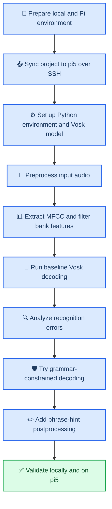

# 树莓派 5 离线中文语音识别实验过程记录

_记录时间：2026-04-19。本文面向课程实验留档，按实际操作顺序整理在树莓派 5 上完成离线中文语音识别实验与改进的全过程。_

---

## 🎯 实验目标

本次实验的目标有 4 个：

1. 在树莓派 5 上通过 SSH 跑通一套最小离线中文语音识别流程。
2. 把语音识别实验中的关键环节落成可执行脚本，包括音频预处理、特征提取和解码识别。
3. 保存完整中间产物，方便分析每一步的输入、输出和效果。
4. 针对“树莓派五”这类领域词误识别问题，尝试做一轮可解释、低成本的改进。

---

## 🧭 实验总流程



---

## 🧰 实验环境

### 本地环境

| 项目 | 内容 |
| --- | --- |
| 工作目录 | `resp_lanu/` |
| 连接方式 | 本机通过 `ssh pi5` 连接树莓派 |
| 本地 Python 环境 | 仓库内 `.venv` |

### 远端环境

| 项目 | 内容 |
| --- | --- |
| 主机别名 | `pi5` |
| 系统 | Debian 13 (`trixie`) |
| 内核 | `6.12.75+rpt-rpi-2712` |
| Python | `3.13.5` |
| 内存 | 4 GB |
| 识别框架 | `Vosk 0.3.45` |

### 主要依赖

| 依赖 | 作用 |
| --- | --- |
| `vosk` | 离线语音识别 |
| `numpy` | 数值计算 |
| `scipy` | 滤波、重采样和 WAV 处理 |
| `python_speech_features` | MFCC、Filter Bank、Delta 特征 |

---

## 🗂️ 实验涉及的核心文件

| 文件 | 作用 |
| --- | --- |
| `scripts/setup_pi.sh` | 在树莓派上安装依赖并准备运行环境 |
| `scripts/preprocess_audio.py` | 音频预处理 |
| `scripts/extract_features.py` | 提取 MFCC、Delta、Filter Bank 特征 |
| `scripts/run_vosk_asr.py` | 调用 Vosk 做解码识别 |
| `scripts/run_pipeline.sh` | 串联完整实验流程 |
| `resp_lanu/audio.py` | 音频加载、去静音、滤波、归一化 |
| `resp_lanu/features.py` | 特征提取与摘要统计 |
| `resp_lanu/asr.py` | 解码与短语提示后处理 |
| `sample_audio/demo_cn.wav` | 示例中文音频 |
| `sample_audio/demo_cn_grammar.json` | 受限语法短语表 |
| `sample_audio/demo_cn_phrase_hints.json` | 领域词修正提示文件 |

---

## 🧪 实验过程

### 1. 准备实验仓库和脚本

首先整理仓库结构，明确把实验拆成 3 个独立环节：

1. 音频预处理。
2. 特征提取。
3. Vosk 离线解码。

这样做的原因是课程实验更强调“链路可解释”，而不是只给出一个最终识别结果。拆开后，每个阶段都可以单独观察和验证。

### 2. 检查树莓派运行条件

通过 SSH 检查 `pi5` 的系统版本、Python 版本、内存和磁盘空间，确认其具备运行小型离线中文模型的基本条件。

同时检查录音设备时发现，当前树莓派环境里没有可用采集硬件，因此本轮实验先使用仓库自带音频 `sample_audio/demo_cn.wav` 来跑通整条链路。

### 3. 同步项目到树莓派

实验中使用了以下思路把本地项目同步到远端：

```bash
tar czf - --exclude='.venv' --exclude='artifacts' --exclude='models' . | ssh pi5 'cd ~/resp_lanu && tar xzf -'
```

同步后在远端运行环境准备脚本：

```bash
ssh pi5 'cd ~/resp_lanu && bash scripts/setup_pi.sh'
```

这一步完成后，树莓派上具备了运行实验所需的 Python 依赖和 Vosk 中文小模型。

### 4. 跑通基线实验

基线实验命令如下：

```bash
ssh pi5 'cd ~/resp_lanu && bash scripts/run_pipeline.sh sample_audio/demo_cn.wav demo_cn_pi5'
```

这条命令会依次完成：

1. 对原始 WAV 做预处理。
2. 提取 MFCC、Delta、Delta-Delta、Filter Bank。
3. 调用 Vosk 中文模型识别。
4. 把输出写入 `artifacts/demo_cn_pi5/`。

基线结果表明，整条离线识别流程已经可以在树莓派 5 上稳定运行。

### 5. 分析基线误识别问题

基线识别文本为：

```text
你好 今天 我们 在 数 没 派 五 上 测试 中文 语音 识别 系统 语音识别 实验 已经 开始
```

参考文本为：

```text
你好，今天我们在树莓派五上测试中文语音识别系统。语音识别实验已经开始。
```

从结果可以看到：

- 大部分句意和词语已经正确。
- `树莓派五` 被识别成了 `数 没 派 五`。
- `中文语音识别系统` 被拆成多个词。

这说明小模型对普通短句基本可用，但对设备名、固定术语和词边界处理还不够稳定。

### 6. 尝试受限语法搜索

为了确认问题是否可以仅靠语言约束解决，进一步使用语法短语表做受限解码：

```bash
ssh pi5 'cd ~/resp_lanu && bash scripts/run_pipeline.sh sample_audio/demo_cn.wav demo_cn_grammar_v2 "" sample_audio/demo_cn_grammar.json'
```

这一轮实验的目的，是缩小搜索空间，观察固定短语能否帮助模型恢复 `树莓派五`。

结果显示，受限语法并没有真正修正 `数 没 派 五`。原因在于模型词表和搜索图本身不支持直接生成目标词形，语法约束只能在已有候选空间里做选择，不能凭空创建模型没有稳定支持的词。

### 7. 设计短语提示后处理改进

在确认“只靠 grammar 不够”之后，采用了更轻量也更可控的方案：在解码后新增一层短语提示后处理。

该方案的核心思想是：

- 保留 `raw_transcript` 作为模型原始输出。
- 根据实验场景维护一个短语提示文件。
- 当识别结果出现已知别名或分词碎片时，把它们映射回标准写法。

本次使用的提示文件是：

```json
[
  {
    "phrase": "树莓派五",
    "aliases": ["树 莓 派 五", "数 没 派 五"]
  },
  {
    "phrase": "中文语音识别系统",
    "aliases": ["中文 语音 识别 系统"]
  },
  {
    "phrase": "语音识别实验",
    "aliases": ["语音 识别 实验", "语音识别 实验"]
  }
]
```

### 8. 验证改进效果

改进后的实验命令如下：

```bash
ssh pi5 'cd ~/resp_lanu && bash scripts/run_pipeline.sh sample_audio/demo_cn.wav demo_cn_hints "" "" sample_audio/demo_cn_phrase_hints.json'
```

这一轮输出中同时保留了原始结果和修正后的最终结果。

原始解码：

```text
你好 今天 我们 在 数 没 派 五 上 测试 中文 语音 识别 系统 语音识别 实验 已经 开始
```

修正后的最终结果：

```text
你好 今天 我们 在 树莓派五 上 测试 中文语音识别系统 语音识别实验 已经 开始
```

自动修正记录为：

- `数 没 派 五 -> 树莓派五`
- `中文 语音 识别 系统 -> 中文语音识别系统`
- `语音识别 实验 -> 语音识别实验`

这说明短语提示后处理对领域词和固定实验术语是有效的。

### 9. 做本地回归验证

除了在 `pi5` 上跑真实实验外，还在本地补了单元测试和基础编译检查，确保改进没有破坏已有流程。

执行过的本地验证包括：

```bash
.venv/bin/python -m unittest tests/test_audio_pipeline.py tests/test_asr_phrase_hints.py
.venv/bin/python -m compileall resp_lanu scripts tests
```

验证结果均通过。

---

## 📊 实验结果汇总

| 阶段 | 方案 | 结果 | 结论 |
| --- | --- | --- | --- |
| 阶段一 | 基线 Vosk 解码 | 跑通全链路，但 `树莓派五` 识别错误 | 系统可用，但领域词不稳定 |
| 阶段二 | 受限语法搜索 | 误识别仍存在 | 仅靠 grammar 不能解决词表外稳定修正 |
| 阶段三 | 短语提示后处理 | `树莓派五` 修正成功，术语合并更自然 | 当前实验条件下最有效 |

---

## 🔍 问题分析

本次实验里最关键的问题是：为什么识别已经“基本能听懂”，但仍会把 `树莓派五` 识别成 `数 没 派 五`？

原因主要有 3 点：

1. 中文小模型容量有限，对设备名和低频词不够敏感。
2. 当前输入是示例音频，不是为该模型专门定制的训练语料。
3. 解码图和词表对目标短语的支持不够稳定，导致即使加入 grammar，也不能可靠恢复目标词。

因此，本实验没有继续走“重训练模型”这条高成本路径，而是优先采用可解释、可审计、易维护的后处理修正策略。

---

## ✅ 实验结论

本次实验完成了以下工作：

1. 在树莓派 5 上通过 SSH 跑通了最小离线中文语音识别系统。
2. 完成了从预处理、特征提取到解码的完整脚本化流程。
3. 成功保存了预处理摘要、特征摘要和识别结果等中间产物。
4. 发现并定位了 `树莓派五` 的误识别问题。
5. 通过短语提示后处理，成功把 `数 没 派 五` 修正为 `树莓派五`。

实验表明，这套方案已经适合做课程演示、链路分析和受控短语识别实验。

---

## 🚀 后续改进方向

下一步可以继续做以下扩展：

1. 接入 USB 麦克风，完成实时录音到识别的现场实验。
2. 继续扩展短语提示文件，覆盖更多课程术语和设备名。
3. 对比中文小模型和其他离线模型在树莓派上的速度与精度。
4. 增加实时流式识别，而不只处理单个 WAV 文件。
5. 在保留后处理层的基础上，进一步尝试更强的模型或更专业的中文词表支持。
